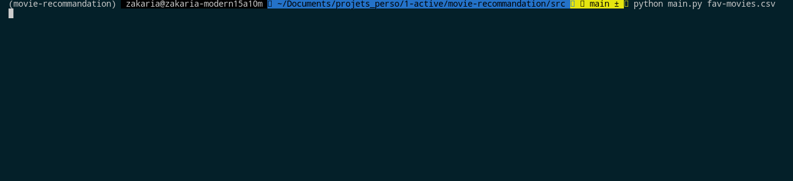

This is intended as a simple pandas miniproject.

# Example output

# Demo

*It is somewhat slow considering the amount of data the script has to read* 

# Requirements

- Python
- Pandas
- [MovieLens dataset](https://grouplens.org/datasets/movielens/), more specifically the [ml-latest.zip](https://files.grouplens.org/datasets/movielens/ml-latest.zip)

# Features

- Recommends a single movie based on user input
- Get average rating of the recommended movie
- Gives a letterboxd URL to a search entry for the movie title

# Usage

`python main.py <foo.csv>`

Where `foo.csv` is a csv file with one column named `movieId` and each line containing the id of the user's favorite movies.

You can find the ids in `ml-latest/movies.csv`

|  |
| --- |
| *Your csv file should look like this* |

## Hierarchy
|  |
| --- | 
| *Your root directory should look like this* |

